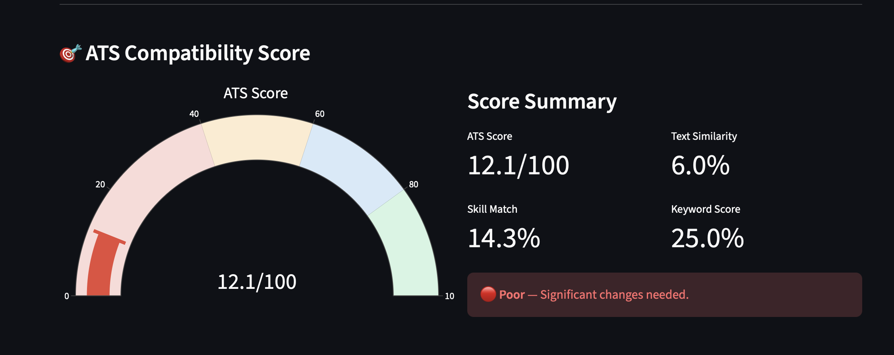
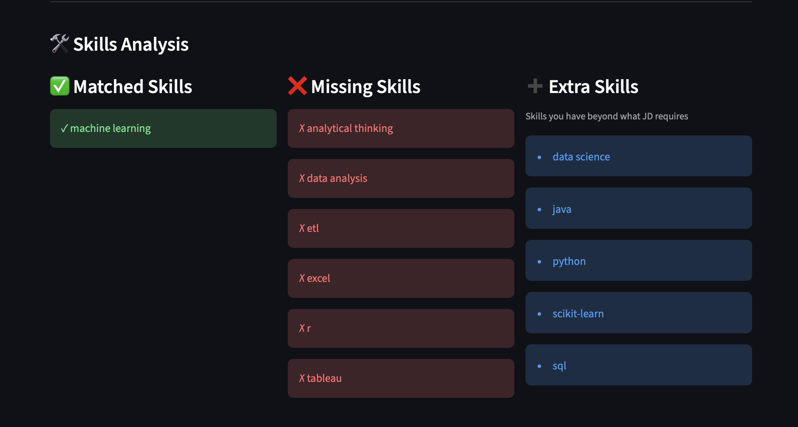
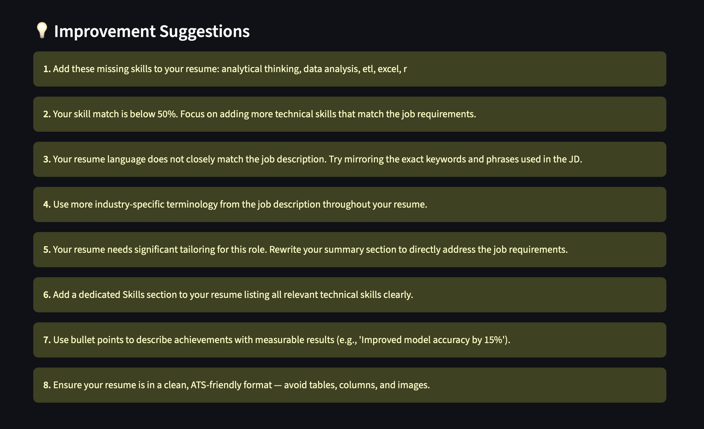

# 📄 AI Resume Analyzer

An intelligent web application that analyzes your resume against a job description using NLP techniques to provide ATS compatibility scoring, skill gap analysis, and actionable improvement suggestions.


---

## 🚀 Features

- ✅ **PDF Resume Parsing** — Extracts text from uploaded PDF resumes using PyPDF2
- ✅ **ATS Score (0–100)** — Weighted compatibility score using TF-IDF + Cosine Similarity
- ✅ **Skill Match Analysis** — Identifies matched and missing skills from 80+ skill database
- ✅ **Skill Gap Report** — Shows exactly what skills to add for the target role
- ✅ **Keyword Analysis** — TF-IDF based keyword comparison between resume and JD
- ✅ **Visual Dashboard** — Interactive Plotly charts (gauge, donut, bar charts)
- ✅ **Improvement Suggestions** — Personalized, actionable recommendations

---

## 📸 Screenshots

### ATS Score Dashboard


### Skills Analysis


### Improvement Suggestions


---

## 🛠️ Tech Stack

| Component | Technology |
|---|---|
| Language | Python 3.13 |
| UI Framework | Streamlit |
| NLP | spaCy (en_core_web_sm) |
| Text Similarity | TF-IDF + Cosine Similarity |
| PDF Parsing | PyPDF2 |
| Visualization | Plotly |
| Data Processing | pandas, numpy |
| Version Control | Git + GitHub |

---

## 📁 Project Structure
```
ai-resume-analyzer/
├── app.py                  # Streamlit UI entry point
├── requirements.txt        # Python dependencies
├── README.md               # Project documentation
├── .gitignore              # Git ignore rules
│
├── modules/                # Core NLP modules
│   ├── __init__.py         # Package initializer
│   ├── parser.py           # PDF text extraction (PyPDF2)
│   ├── nlp_processor.py    # Text cleaning with spaCy
│   ├── skill_extractor.py  # Skill matching and gap analysis
│   ├── scorer.py           # ATS score calculation (TF-IDF)
│   └── visualizer.py       # Plotly chart generation
│
├── data/
│   └── skills_db.py        # 80+ curated skills database
│
└── assets/
    └── screenshots/        # App screenshots for README
```

---

## ⚙️ How It Works

1. **Upload** → PyPDF2 extracts raw text from your PDF resume
2. **Process** → spaCy cleans and normalizes both texts (lemmatization, stopword removal)
3. **Extract** → Skills matched against a database of 80+ technical and soft skills
4. **Score** → TF-IDF vectorization + cosine similarity produces ATS score
5. **Visualize** → Plotly dashboard shows results with interactive charts
6. **Suggest** → Personalized improvement recommendations generated

---

## 🧠 ATS Score Formula

The ATS score is a weighted combination of three components:

| Component | Weight | Description |
|---|---|---|
| Skill Match | 50% | % of JD skills found in resume |
| Text Similarity | 40% | Cosine similarity of TF-IDF vectors |
| Keyword Score | 10% | Top JD keywords found in resume |

---

## ⚙️ Setup & Installation
```bash
# 1. Clone the repository
git clone https://github.com/kuriant560/ai-resume-analyzer.git
cd ai-resume-analyzer

# 2. Create a virtual environment
python3 -m venv venv
source venv/bin/activate

# 3. Install dependencies
pip install -r requirements.txt

# 4. Download spaCy language model
python -m spacy download en_core_web_sm

# 5. Run the application
streamlit run app.py
```

---

## 📌 Future Improvements

- [ ] OCR support for scanned PDF resumes (Tesseract)
- [ ] Export analysis report as PDF
- [ ] Support for DOCX resume format
- [ ] Job role specific skill databases
- [ ] Cover letter analyzer

---

## 👤 Author

**Kurian Thomas** · [GitHub](https://github.com/kuriant560)

---

## 📄 License

This project is licensed under the MIT License.
